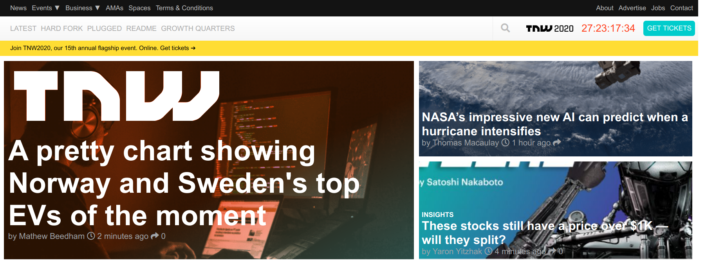

# The Next Web Clone

> A project to replicate elements of the The Next Web homepage using principle of responsive web design.

The project uses media queries to make the website responsive on multiple screen resolutions. It tries to replicate the media query breakpoints of the original The Next Web homepage.

## Built With

- HTML
- CSS
- Font Awesome

## Live Demo

[Live Demo Link](https://meronokbay.github.io/next-web-clone/)

## Authors

👤 **Meron Ogbai**

- Github: [@meronokbay](https://github.com/meronokbay)
- Twitter: [@MeronDev](https://twitter.com/MeronDev)
- Linkedin: [linkedin](https://linkedin.com/in/meron-ogbai-467414198/)

👤 **Alaukik**

- Github: [@newhorizon-tech](https://github.com/newhorizon-tech)
- Twitter: [@techintosh3](https://twitter.com/techintosh3)

## 🤝 Contributing

Contributions, issues and feature requests are welcome!

Feel free to check the [issues page](https://github.com/meronokbay/next-web-clone/issues).

## Show your support

Give a ⭐️ if you like this project!
